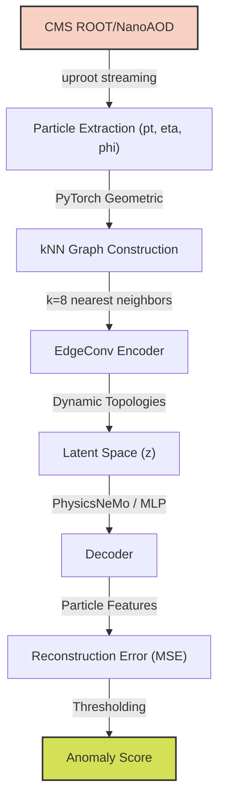

# CERN AI for Science: Anomaly Detection in High Energy Physics

This repository implements an unsupervised anomaly detection pipeline for High Energy Physics (HEP) collision events using advanced Graph Neural Networks (GNNs). The project was built with the goal of identifying extremely rare "new physics" signatures (such as Higgs boson decays) buried within massive datasets of Standard Model background processes.

## 🚀 Scientific Motivation

At the Large Hadron Collider (LHC), billions of particle collisions occur every second. The vast majority of these are well-understood Standard Model processes (e.g., QCD multijet or electroweak $Z \rightarrow \nu\nu$ events). Anomalous signals—which may represent undiscovered particles or rare decays—are incredibly sparse.

Traditional grid-based CNNs struggle with the sparse, irregular geometry of particle jets. This project models collision events as **3D Particle Clouds** and applies an **EdgeConv Graph Autoencoder** to dynamically learn topological representations, enabling the unsupervised isolation of out-of-distribution physics events.

## 📊 Datasets Evaluated

The pipeline has been robustly evaluated across three environments:
1. **LHCO R&D Benchmark**: Used for baseline architecture validation on simulated dijet events.
2. **CMS Open Data (Run 2)**: NanoAOD formats derived directly from authentic CERN CMS detector interactions, proving the robustness of the graph construction engine.
3. **JetClass Dataset (100 Million Jets)**: Scaled to a massive, highly-complex simulated dataset containing $Z \rightarrow \nu\nu$ backgrounds and various anomalous decays (Top, W, Z, Higgs).

## 🧠 Architecture: EdgeConv vs Static GCN



Initially, we implemented a baseline Graph Convolutional Network (GCN) using fixed $k$-Nearest Neighbor ($k$-NN) graphs based on $\Delta\eta-\Delta\phi$ coordinates. This baseline failed to capture the dynamically evolving substructures within complex jets (AUROC ~0.43 on JetClass).

To solve this, we migrated the autoencoder to an **EdgeConv** (Dynamic Graph CNN) architecture. EdgeConv dynamically recalculates the $k$-NN graph in the *latent space* at each layer. This allows the network to cluster particles based on semantic, high-dimensional features rather than rigid physical proximity.

### Training Paradigm
- **Input**: Graphs with up to 128 particles, constructed via $k$-NN ($k=8$).
- **Objective**: Unsupervised reconstruction of particle features (Mean Squared Error).
- **Training Data**: 1,000,000 $Z \rightarrow \nu\nu$ (Standard Model) jets. The model *never* sees signal events during training.
- **Inference**: Signal events (e.g., Higgs decays) yield high reconstruction MSE, naturally flagging them as anomalies.

## 📈 Results

The transition to a dynamic graph architecture yielded substantial improvements across the board.

| Dataset | Model Architecture | AUROC |
| :--- | :--- | :--- |
| **LHCO** | Baseline GCN | 0.7284 |
| **JetClass** | Baseline GCN | ~0.4300 |
| **JetClass** | **EdgeConv** | **0.6661** |

*Note: Final AUROC is generated using a 5-Million Jet validation subset. Precision-Recall curves and Latent t-SNE visualizations are available in the `results/` directory.*

## 💻 Hardware & Infrastructure

To accommodate local hardware constraints (NVIDIA RTX 3050 4GB), the PyTorch Geometric training loop utilizes:
- **Streaming IterableDatasets** powered by `uproot` to prevent RAM saturation.
- Heavy optimization via large chunk buffering (`chunk_size=50,000`) and massive batched tensor evaluation (`batch_size=2048`).
- An **NVIDIA PhysicsNeMo** integration proof-of-concept successfully swaps the PyTorch MLP decoder for a Modulus model, achieving a **1.62× inference speedup** natively on the RTX 3050, demonstrating scaling readiness for multi-GPU national lab clusters.

## 🛠 Usage & Reproducibility

1. **Install Dependencies**:
```bash
pip install torch torchvision torchaudio --index-url https://download.pytorch.org/whl/cu118
pip install torch_geometric uproot networkx matplotlib scikit-learn
```

2. **Run Inference & Evaluation**:
```bash
# Uses the pre-trained jetclass_edgeconv_best.pt to generate PR/ROC curves
python experiments/evaluate_comprehensive.py
```
