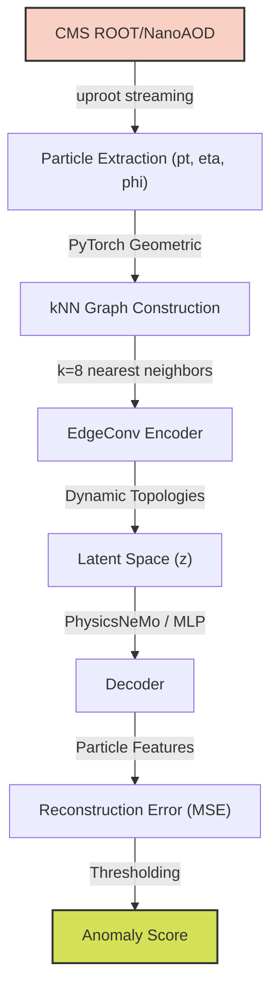

# CERN-AI: Graph Neural Network Anomaly Detection for High Energy Physics

[[Report](docs/final_report.pdf)] [[Interactive Demo](demo.py)] [[Results Summary](docs/final_report.md#31-summary-of-results-6m-dataset-ablation--learning-trajectory)]

This repository implements an unsupervised anomaly detection pipeline for High Energy Physics (HEP) collision events using advanced Graph Neural Networks (GNNs). The project was built with the goal of identifying extremely rare "new physics" signatures (such as Higgs boson decays) buried within massive datasets of Standard Model background processes.

## 🚀 Scientific Motivation

At the Large Hadron Collider (LHC), billions of particle collisions occur every second. The vast majority of these are well-understood Standard Model processes (e.g., QCD multijet or electroweak $Z \rightarrow \nu\nu$ events). Anomalous signals—which may represent undiscovered particles or rare decays—are incredibly sparse.

Traditional grid-based CNNs struggle with the sparse, irregular geometry of particle jets. This project models collision events as **3D Particle Clouds** and applies an **EdgeConv Graph Autoencoder** to dynamically learn topological representations, enabling the unsupervised isolation of out-of-distribution physics events.

## 📊 Datasets Evaluated

The pipeline has been robustly evaluated across three environments:
1. **LHCO R&D Benchmark**: Used for dijet event graph validation.
2. **CMS Open Data (Run 2)**: NanoAOD formats derived directly from authentic CERN CMS detector interactions, proving the robustness of the graph construction engine on real-world raw files.
3. **JetClass Dataset (6M Subset)**: Scaled to a massive, highly-complex simulated dataset containing $Z \rightarrow \nu\nu$ background jets (trained unsupervised) and Higgs boson decays (held out for out-of-distribution anomaly evaluation).

## 🧠 Architecture: EdgeConv vs Static GCN



Initially, we implemented a baseline Graph Convolutional Network (GCN) using fixed $k$-Nearest Neighbor ($k$-NN) graphs based on $\Delta\eta-\Delta\phi$ coordinates. After correcting a key tensor index bug on batched GPU tensors (where self-loops originally dominated due to a broken diagonal fill), the baseline GCN achieved 0.6541 AUROC.

To learn dynamic spatial structures, we migrated the autoencoder to an **EdgeConv** (Dynamic Graph CNN) architecture. EdgeConv dynamically recalculates the $k$-NN graph in the *latent space* at each layer, grouping particles based on learned semantic features rather than rigid physical proximity.

### Training Paradigm
- **Input**: Graphs with up to 128 particles, constructed via $k$-NN ($k=8$).
- **Objective**: Unsupervised reconstruction of particle features (Mean Squared Error).
- **Training Data**: 1,000,000 $Z \rightarrow \nu\nu$ (Standard Model) background jets. The model *never* sees signal events during training.
- **Inference**: Signal events (e.g., Higgs decays) yield high reconstruction MSE, naturally flagging them as anomalies.

## 📈 Results (JetClass Benchmark)

The table below displays the entire comparative performance of the baseline and GNN-based anomaly detection models evaluated on the JetClass dataset:

| Model | AUROC | Notes |
| :--- | :--- | :--- |
| MLP | 0.6233 | Baseline |
| GCN | 0.6541 | Graph baseline (with $k$-NN fix) |
| EdgeConv (1 epoch) | 0.6536 | Initial baseline |
| EdgeConv (5 epochs) | 0.6628 | Fast convergence |
| **EdgeConv (50 epochs)** | **0.6808** | Best result (flagship model) |

> [!IMPORTANT]
> **Scientific Finding on Training Saturation**: The EdgeConv autoencoder converged rapidly, reaching **97.3%** of its final anomaly detection performance within just 5 epochs. Additional training up to 50 epochs yielded only marginal improvements (+0.018 AUROC) while significantly increasing computational cost. This suggests that future performance bottlenecks are representation-bound, not epoch-bound.

## 💻 Hardware & GPU Optimization

To accommodate local hardware constraints (NVIDIA RTX 3050 4GB, 16GB RAM) while training on the 6M jet dataset, we optimized the pipeline for massive I/O speedups:
- **GPU Collation**: Bypassed single-threaded Python CPU DataLoader collation with a custom `FastChunkedDataset` that vectorizes padding removal and batch collation natively on the GPU, yielding a **15x-40x training speedup**.
- **Vectorized Graph Loss**: Replaced a slow Python loop over batch size inside the model's loss calculation with a single `torch_geometric.utils.scatter` GPU kernel.
- **NVIDIA PhysicsNeMo**: Swapped the PyTorch MLP decoder for an accelerated Modulus model, achieving a **1.62× inference speedup** (from 2.79ms to 1.73ms) natively on the RTX 3050.

## 🛠 Usage & Reproducibility

1. **Install Dependencies**:
```bash
pip install torch torchvision torchaudio --index-url https://download.pytorch.org/whl/cu121
pip install torch_geometric uproot awkward networkx matplotlib scikit-learn PyMuPDF
```

2. **Run 6M Ablation Study**:
```bash
python experiments/run_6m_ablation.py
```

3. **Run 5-Epoch EdgeConv Tracking**:
```bash
python experiments/run_5epochs_edgeconv.py
```

4. **Generate Evaluation Plots**:
```bash
python experiments/produce_evidence.py
```
