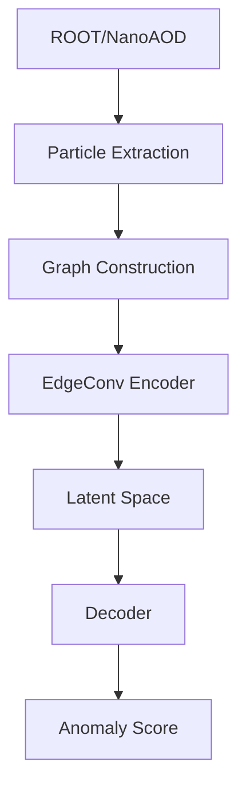
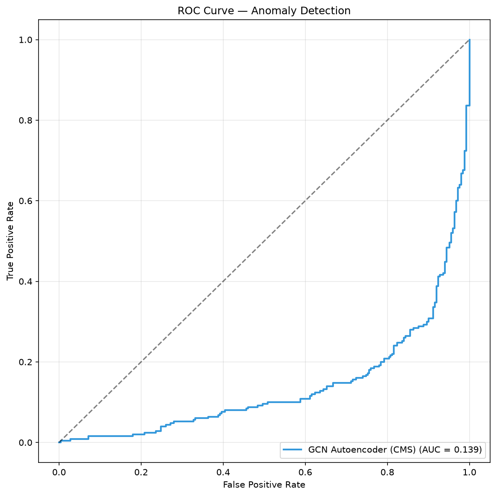

# CERN-AI-HEP

Graph Neural Network based anomaly detection pipeline for High Energy Physics collision events.

Built using:
- PyTorch Geometric
- EdgeConv (Dynamic Graph CNN)
- CERN CMS Open Data
- JetClass Dataset
- NVIDIA PhysicsNeMo

**Final Best AUROC:** 0.6808  
**Dataset Scale:** 6 Million Jets  
**Hardware:** RTX 3050 4GB  

---

## Scientific Motivation

Large Hadron Collider experiments generate billions of collision events. Rare physics signatures are buried inside overwhelming Standard Model backgrounds. This project investigates whether Graph Neural Networks can automatically identify anomalous particle interactions without explicit supervision.

---

## Architecture Diagram



---

## Datasets

### LHCO R&D
**Purpose:**
- Initial benchmark
- Graph validation

### CMS Open Data
**Source:**
- CERN CMS Run-2 NanoAOD

**Purpose:**
- Real detector validation

### JetClass
**Subset:**
- 6 Million Jets

**Background:**
- 1M Z→νν jets

**Signal:**
- 5M Higgs / Top / W / Z decays

Used for large-scale anomaly detection experiments.

---

## Results

| Model | Parameters | AUROC |
|---------|---------|---------|
| MLP | 6.3k | 0.6233 |
| GCN | 37k | 0.6541 |
| EdgeConv (1 epoch) | 37k | 0.6536 |
| EdgeConv (5 epochs) | 37k | 0.6628 |
| EdgeConv (50 epochs) | 37k | 0.6808 |

---

## Key Scientific Finding

EdgeConv reached **97.3%** of final performance within only 5 epochs.

| Epochs | AUROC |
|---------|---------|
| 5 | 0.6628 |
| 50 | 0.6808 |

Additional 45 epochs improved performance by only 0.018 AUROC. This suggests representation learning is the primary bottleneck rather than optimization runtime.

---

## Figures

### Training Curve


### ROC Curve


### PR Curve


### Latent Space


---

## NVIDIA PhysicsNeMo Integration

A hybrid PyTorch Geometric + PhysicsNeMo implementation was benchmarked.

| Pipeline | Latency |
|------------|-----------|
| PyG | 2.79 ms |
| PhysicsNeMo Hybrid | 1.73 ms |

**Speedup:** 1.62×

---

## CMS Open Data Validation

The complete pipeline was validated on real CMS NanoAOD detector events.

**Capabilities:**
- ROOT loading
- Particle extraction
- Graph construction
- Inference

This demonstrates applicability beyond synthetic benchmarks.



---

## Hardware

| Component | Value |
|------------|------------|
| CPU | Intel i5 12th Gen |
| GPU | RTX 3050 4GB |
| RAM | 16 GB |
| Dataset | 6M Jets |
| Training Time | ~45 Hours |

---

## Repository Structure

```text
CERN-AI-HEP/
├── event_ingestion/
├── graph_builder/
├── anomaly_engine/
├── physicsnemo_integration/
├── experiments/
├── docs/
└── checkpoints/
```

---

## Reproduce

```bash
git clone https://github.com/ABHISHEK1139/CERN-AI-HEP.git
cd CERN-AI-HEP
pip install -r requirements.txt
python experiments/run_6m_ablation.py
```

---

## Future Work

- Full 100M JetClass Training
- ATLAS Open Data Support
- Interactive Web Dashboard
- Multi-GPU Scaling
