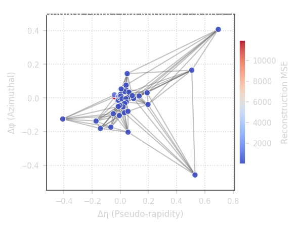
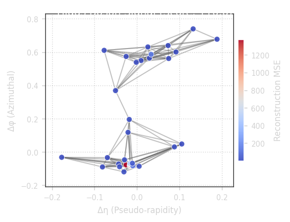
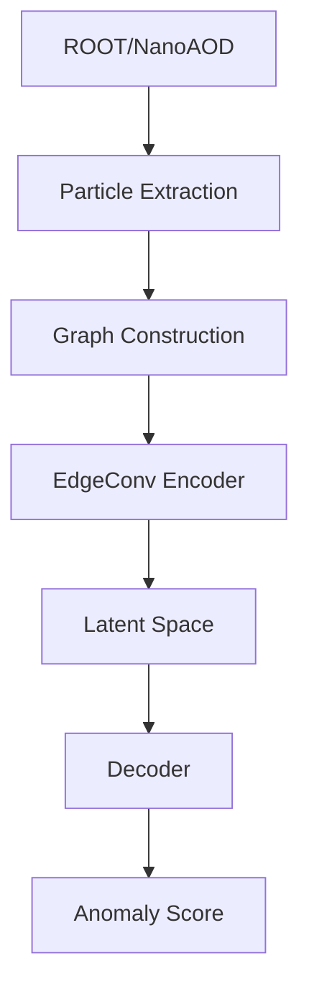

# CERN-AI-HEP

Graph Neural Network based anomaly detection pipeline for High Energy Physics collision events.

Built using:
- PyTorch Geometric
- EdgeConv (Dynamic Graph CNN)
- CERN CMS Open Data
- JetClass Dataset
- NVIDIA PhysicsNeMo

**Best JetClass AUROC:** 0.6808  
**Dataset Scale:** 6 Million Jets  
**Hardware:** RTX 3050 4GB  

## 3D Particle Cloud Topologies ($\Delta\eta$-$\Delta\phi$ Plane)

| Standard Model Background | Higgs Boson Anomaly |
|:---:|:---:|
|  |  |

*Red nodes indicate particles with high reconstruction error flagged by the unsupervised autoencoder.*

---

## Scientific Motivation

Large Hadron Collider experiments generate billions of collision events. Rare physics signatures are buried inside overwhelming Standard Model backgrounds. This project investigates whether Graph Neural Networks can prioritize unusual collision-event candidates for physicist review without relying on explicit anomaly labels.

---

## Architecture Diagram



---

## Datasets

### LHCO R&D
**Purpose:**
- Initial benchmark
- Graph validation

### CMS Open Data
**Source:**
- CERN CMS Run-2 NanoAOD

**Purpose:**
- Real detector validation

### JetClass
**Subset:**
- 6 Million Jets

**Background:**
- 1M Z -> nu nu jets

**Signal:**
- 5M Higgs / Top / W / Z decays

Used for large-scale anomaly detection experiments.

---

## Results

| Model | Parameters | AUROC |
|---------|---------|---------|
| MLP | 6.3k | 0.6233 |
| GCN | 37k | 0.6541 |
| EdgeConv (1 epoch) | 37k | 0.6536 |
| EdgeConv (5 epochs) | 37k | 0.6628 |
| EdgeConv (50 epochs) | 37k | 0.6808 |

---

## Training Saturation Analysis

The EdgeConv autoencoder achieved 0.6628 AUROC after only 5 epochs and 0.6808 AUROC after 50 epochs. Thus, over 97% of the final performance was obtained during the initial training phase.

| Epochs | AUROC |
|---------|---------|
| 5 | 0.6628 |
| 50 | 0.6808 |

The remaining 45 epochs produced only a modest improvement of 0.018 AUROC, indicating that the model converges rapidly on the JetClass benchmark. These results suggest that future improvements are likely to depend more on representational capacity, feature engineering, or architectural design than on extending training duration alone.

---

## Figures

### Training Curve


### Anomaly Score Distribution


### ROC Curve


### PR Curve


### Latent Space


---

## NVIDIA PhysicsNeMo Integration

A hybrid PyTorch Geometric + PhysicsNeMo implementation was benchmarked.

| Pipeline | Latency |
|------------|-----------|
| PyG | 2.79 ms |
| PhysicsNeMo Hybrid | 1.73 ms |

**Speedup:** 1.62x

---

## CMS Open Data Validation

The complete pipeline was validated on real CMS NanoAOD detector events.

**Capabilities:**
- ROOT loading
- Particle extraction
- Graph construction
- Inference

This demonstrates applicability beyond synthetic benchmarks.


---

## Hardware

| Component | Value |
|------------|------------|
| CPU | Intel i5 12th Gen |
| GPU | RTX 3050 4GB |
| RAM | 16 GB |
| Dataset | 6M Jets |
| Training Time | ~45 Hours |

---

## Repository Structure

```text
CERN-AI-HEP/
|-- event_ingestion/
|-- graph_builder/
|-- anomaly_engine/
|-- physicsnemo_integration/
|-- experiments/
|-- docs/
`-- checkpoints/
```

---

## Reproduce

### Quick smoke test

Use the small synthetic configuration to verify that data generation, graph construction, training, and evaluation run end-to-end:

```bash
git clone https://github.com/ABHISHEK1139/CERN-AI-HEP.git
cd CERN-AI-HEP
pip install -r requirements.txt
python experiments/train_classifier.py --config experiments/configs/smoke.yaml --model gcn --epochs 2 --device cpu
```

### Full JetClass benchmark

The large-scale result requires the JetClass files and is intended for a longer GPU run:

```bash
python experiments/run_6m_ablation.py
```

---

## Future Work

- Full 100M JetClass Training
- ATLAS Open Data Support
- Web dashboard polish and packaged demo data
- Multi-GPU Scaling
