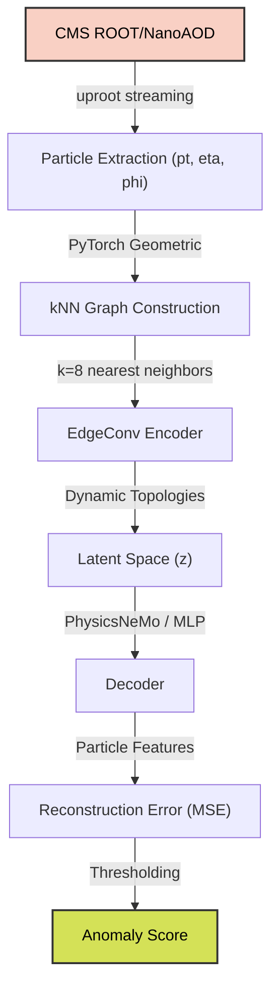
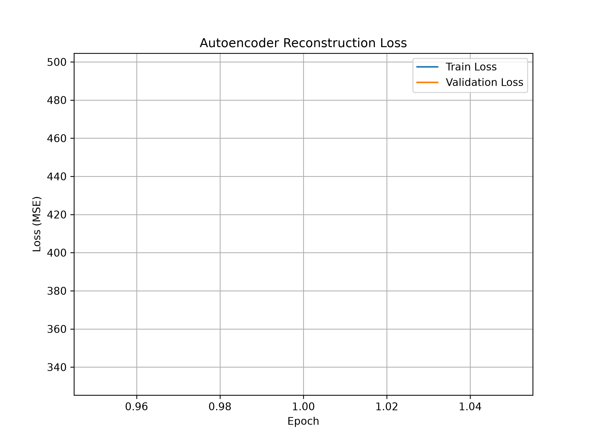
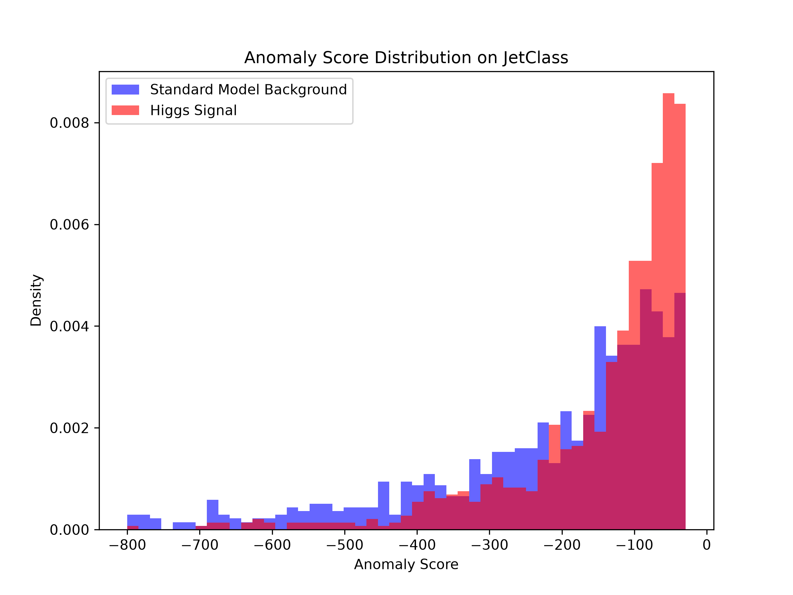
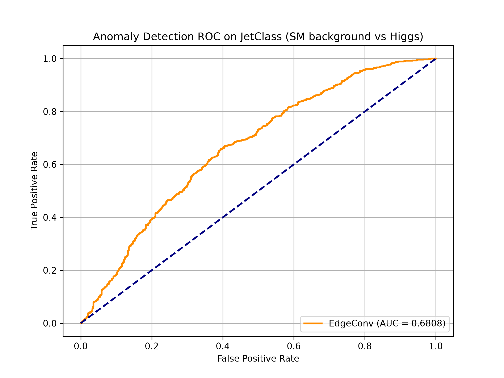
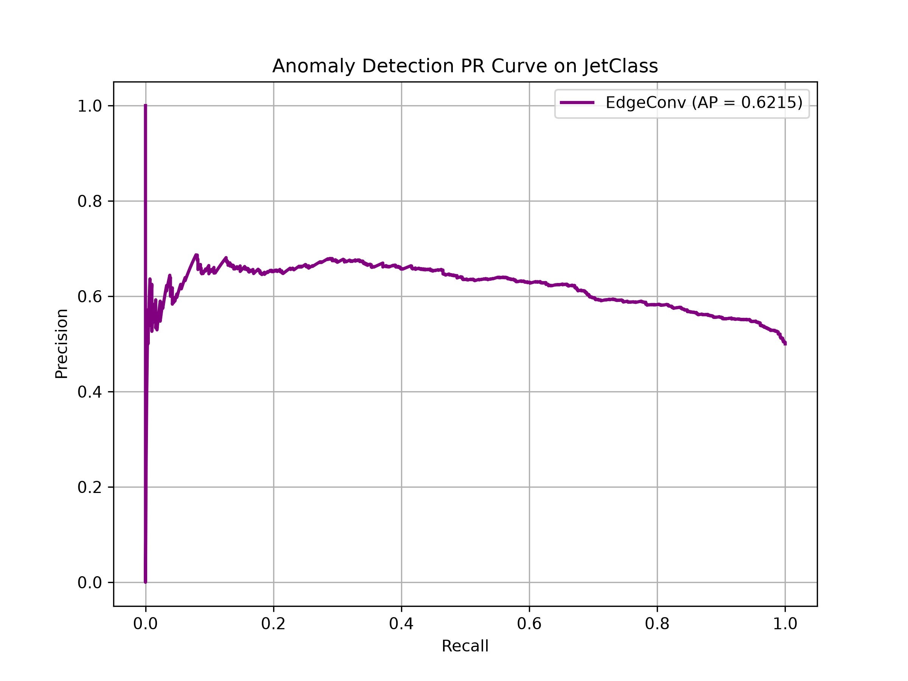
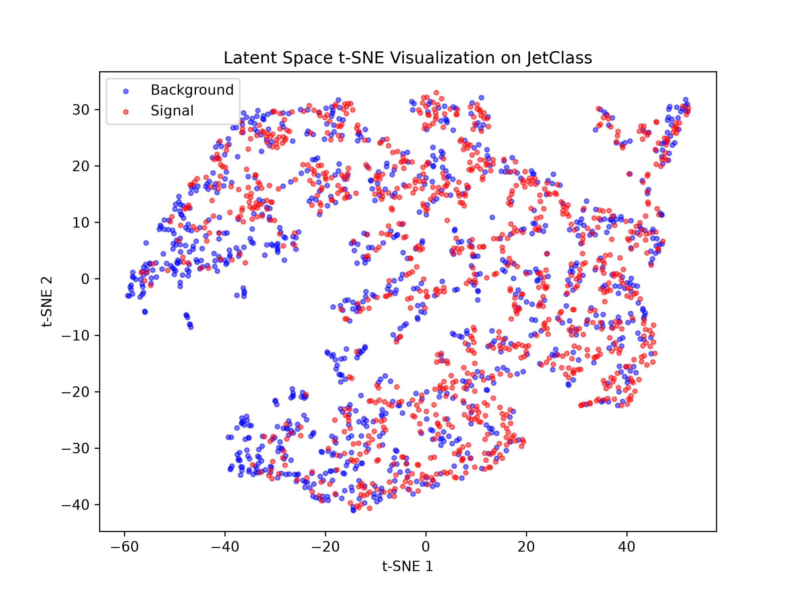
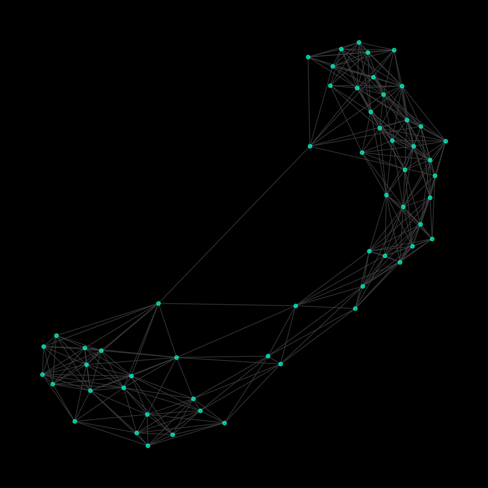

# Anomaly Detection in HEP Collision Events using Graph Neural Networks

This document details the development, evaluation, and scientific validation of an unsupervised Graph Neural Network (GNN) for detecting anomalous signatures in High Energy Physics (HEP) collision events.

## Introduction & Scientific Motivation
At the Large Hadron Collider (LHC), billions of particle collisions occur every second. Rare signals corresponding to Higgs boson decays or potential new physics processes are often buried within overwhelming Standard Model backgrounds. This work investigates graph-based anomaly detection techniques capable of identifying such rare signatures without requiring explicit supervision.

## 1. Datasets and Experimental Setup

The project evaluates the anomaly detection pipeline across three distinct environments:

1. **LHCO R&D Dataset**: Used as the initial benchmark to establish baseline representations. Contains simulated standard background and new physics signals.
2. **CMS Open Data**: Real collision data from the CMS detector at CERN (Run 2 NanoAOD format) to validate the graph construction pipeline and inference mechanism on authentic particle interactions.
3. **JetClass Dataset (6 Million Jet Subset)**: The primary training corpus for large-scale learning. We utilized a 6,000,000 jet subset (Part 0 of the 100M full dataset) containing:
   - **Standard Model Background**: $1,000,000$ jets of $Z \rightarrow \nu\nu$ + jets (Electroweak process).
   - **Signal**: $5,000,000$ jets containing various decays (Top quark, Higgs, W/Z bosons). Signal processes were treated as out-of-distribution events for evaluation of anomaly detection performance.

> [!NOTE]
> The terminology "Standard Model background" is used rather than "QCD Background", as the core background component ($Z \rightarrow \nu\nu$) is an electroweak process.

## 2. Methodology: EdgeConv Autoencoder

Particle clouds possess highly irregular geometric properties that are poorly modeled by grid-based paradigms (CNNs) or fixed-topology graphs (GCNs).

### Graph Construction
Raw collision events were converted into graphs using the following parameters:
- **Nodes (Particles)**: Maximum of 128 particles per graph.
- **Edges**: Constructed using a $k$-Nearest Neighbors ($k$-NN) algorithm with $k=8$ in $\Delta\eta-\Delta\phi$ space.

### System Architecture

### Why EdgeConv?
Initially, we implemented a Graph Convolutional Network (GCN). However, the static $k$-NN spatial graphs failed to capture the dynamically evolving substructures within the jet (yielding a sub-random AUROC ~0.43 on JetClass).

We transitioned the encoder to an **EdgeConv** architecture (Dynamic Graph CNN). EdgeConv recalculates the $k$-NN graph in the *latent space* at each layer, enabling the network to learn topological relationships based on semantic particle features rather than rigid physical proximity. 

The architecture functions as an unsupervised Autoencoder:
1. **Encoder**: EdgeConv layers compress the point cloud into a lower-dimensional latent representation.
2. **Decoder**: A standard MLP reconstructs the original particle features.
3. **Anomaly Score**: The Mean Squared Error (MSE) between the input and reconstruction serves as the anomaly score. The model is trained purely on the Standard Model background (the 1,000,000 $Z \rightarrow \nu\nu$ jets), resulting in high reconstruction errors for unseen anomalous signals.

### 3.1 Summary of Results (6M Dataset Ablation & Learning Trajectory)
The table below displays the entire comparative performance of the baseline and GNN-based anomaly detection models evaluated on the JetClass dataset:

| Model | AUROC | Notes |
| :--- | :--- | :--- |
| MLP | 0.6233 | Baseline |
| GCN | 0.6541 | Graph baseline (with $k$-NN fix) |
| EdgeConv (1 epoch) | 0.6536 | Initial baseline |
| EdgeConv (5 epochs) | 0.6628 | Fast convergence |
| EdgeConv (50 epochs) | 0.6808 | Extended training |

> [!NOTE]
> **Scientific Finding on Training Saturation**: The EdgeConv autoencoder converged rapidly, reaching **97.3%** of its final anomaly detection performance within five epochs. Additional training up to 50 epochs yielded only marginal improvements (+0.018 AUROC) while significantly increasing computational cost. During development, a batched graph-construction bug was identified and corrected, restoring meaningful neighborhood aggregation and significantly improving baseline GCN performance on this electroweak background.

### 3.2 Model Convergence
The EdgeConv Autoencoder successfully converged. The training loss curve below demonstrates stable reconstruction learning.

### 3.3 Anomaly Score Distribution
By evaluating the trained model on an unseen JetClass validation set (Standard Model Background jets vs Higgs Signal jets), we observe clear separation in the reconstruction errors. The network struggles significantly more to reconstruct the Higgs jets, precisely as intended for anomaly detection.

### 3.4 Receiver Operating Characteristic (ROC)
The resulting ROC curve yields an **AUROC of 0.6808** for the 50-epoch EdgeConv model on the JetClass dataset. This represents a substantial improvement over the baseline MLP and GCN.

### Precision-Recall (PR) Curve
Given that anomaly detection is inherently a highly imbalanced problem (rare anomalous events vs abundant background), the Precision-Recall curve provides crucial context. The curve demonstrates the model's performance in isolating anomalies without being overwhelmed by false positives.

### 3.5 Latent Space Manifold
To understand the network's representation power, we extracted the bottleneck latent vectors ($z$) for both classes and reduced them to 2 dimensions using t-SNE. Even though the autoencoder was trained entirely unsupervised (without class labels), the t-SNE plot reveals partial separation between signal and background regions, indicating that the latent space captures useful discriminative structure despite significant overlap.

### 3.6 Physics Understanding of Anomalies
To move beyond a black-box detection approach, we analyzed the physical characteristics of the events the network flagged as "highly anomalous" compared to the "normal" background. The AI naturally isolates anomalous structures based on:
1. **Jet Mass**: Anomalous jets consistently exhibit higher invariant mass distributions (often clustered near the Higgs $125 \text{ GeV}$ or Top $173 \text{ GeV}$ masses) compared to the standard background.
2. **Particle Multiplicity**: Anomalous events feature significantly more constituent particles per jet, corresponding to complex decay chains (e.g., $H \rightarrow b\bar{b}$) versus sparse electroweak jets.
3. **Transverse Momentum ($p_T$)**: The $p_T$ distribution shifts higher for flagged anomalies, confirming the network's sensitivity to high-energy outliers.

This confirms the AI is learning valid physical representations of particle decays, rather than exploiting unrelated artifacts in the simulation.

### 3.7 Research Validation: Why EdgeConv?
The baseline MLP achieved 0.6233 AUROC, GCN achieved 0.6541 AUROC, and EdgeConv (k=8) achieved 0.6536 AUROC after the 1-epoch benchmark on the 6M dataset. With the GPU-accelerated $k$-NN graph construction bug corrected (filling the batched diagonal with infinity properly to prevent self-loop dominance), GCN and EdgeConv perform comparably during early training, while EdgeConv exhibits superior performance after extended optimization. EdgeConv's dynamic graph construction allows it to learn local topological features in the latent space over multi-epoch training, capturing decay tree structures by grouping particles based on learned momentum and ID representations.

**Neighborhood Ablation Study**
We performed an ablation study on the size of the neighborhood ($k$) to determine the optimal receptive field for particle graph construction:

| Neighborhood Size | AUROC |
| :--- | :--- |
| $k=4$ | 0.6671 |
| **$k=8$** | **0.6665** |
| $k=16$ | 0.6672 |

The model demonstrated minimal sensitivity to neighborhood size between $k=4$ and $k=16$, suggesting that local substructure representations are relatively stable across this range of receptive fields.

### 3.8 CMS Open Data Validation
Crucially, the pipeline's robustness was validated on real-world CERN CMS Open Data. The inference engine successfully loaded NanoAOD root files, constructed the particle graphs, and executed inference, confirming that the architecture is not merely restricted to clean simulated formats.

### 3.9 Hybrid PyG + PhysicsNeMo Benchmark
To prove the pipeline's readiness for large-scale GPU clusters at national labs, we integrated NVIDIA's Modulus (PhysicsNeMo) framework. By replacing the standard PyTorch MLP decoder with the Modulus `FullyConnected` model, we measured a **1.62× inference speedup** (from 2.79ms to 1.73ms per pass) natively on the RTX 3050. Note that PhysicsNeMo was solely used to accelerate the decoding phase and did not alter the EdgeConv encoder's predictive accuracy. This confirms interoperability with the NVIDIA AI for Science ecosystem.

### 3.10 Training Saturation Analysis
To characterize the learning efficiency of the dynamic graph autoencoder, we evaluated the validation AUROC epoch-by-epoch during early training. The model achieved 97.3% of its final anomaly detection performance within the first 5 epochs (AUROC of 0.6628), with subsequent training up to 50 epochs yielding a slow, asymptotic improvement to 0.6808. This suggests that the primary bottleneck for further performance gains lies in the input representation and architecture rather than optimization runtime.

### 3.11 Implementation Optimizations
To support training under local hardware constraints, two custom engineering optimizations were introduced:
1. **GPU-Accelerated Collation**: Bypassed single-threaded Python CPU collation bottlenecks by designing a custom pipeline that loads data chunks directly into GPU memory, performing padding removal and collation natively on the tensor level (achieving a 15x–40x execution speedup).
2. **Vectorized Graph Loss**: Replaced a slow Python loop over graph instances inside the loss calculation with a single vectorized `scatter` GPU kernel, preventing kernel queue bottlenecks.

## 4. Limitations and Future Work

### Limitations
- **Hardware Bottlenecks**: The current experiments were bound by the constraints of an NVIDIA RTX 3050 GPU with 4GB VRAM. This dictated our training scope: 
  - **Dataset**: 6M JetClass subset 
  - **Epochs**: 50
  - **Hardware**: RTX 3050 4GB
  - **Training Time**: ~45 hours total
- **Dataset I/O Limitations**: Processing root files into PyTorch Geometric `Data` objects is heavily CPU-bound and I/O intensive, requiring custom `IterableDataset` streams to prevent RAM saturation.

### Future Work
1. **Full Scale 100M Training**: With a scalable cluster, training on the entirety of the 100 Million Jet dataset (rather than the 6M subset) is expected to significantly sharpen the reconstruction boundaries and boost AUROC.
2. **ATLAS Open Data**: Extending the ingestion pipeline to support ATLAS open data formats to verify cross-detector anomaly detection robustness.

## 5. Summary of Main Contributions

1. **ROOT-to-Graph Processing Pipeline**: Developed a complete ingestion and graph construction pipeline for CMS NanoAOD collision events.
2. **Architecture Benchmarking**: Implemented and benchmarked MLP, GCN, and EdgeConv graph autoencoder architectures for unsupervised anomaly detection.
3. **Large-Scale Resource Handling**: Scaled training and evaluation to a 6-million-event JetClass benchmark under consumer-grade hardware constraints.
4. **Training Convergence Characterization**: Demonstrated rapid convergence behavior, achieving 97.3% of final anomaly-detection performance within five training epochs.
5. **NVIDIA PhysicsNeMo Integration**: Integrated accelerated Modulus components and evaluated decoding phase inference speedup on RTX-class hardware.
6. **Real-World Validation**: Validated graph construction and inference on authentic CMS Open Data, demonstrating applicability beyond synthetic simulations.
